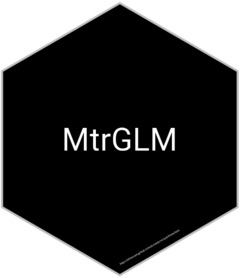

# MtrGLM 

<!-- badges: start -->
<!-- badges: end -->

Mglm is a package designed to facilitate the calculation of metrics of a generalized linear model for binary response variable. In particular, the package in this first version allows calculating the metrics associated with the confusion matrix (Recall, Precision, Accuracy and F1 Score), in addition to a series of graphs (ROC, PR, Gain  and KS curves).

## Installation

To install the package it is necessary to run `devtools::install_github("Dfranzani/MtrGLM")`, which does not include the vignettes.

<!--
To include vignettes in installations, run `devtools::install_github("Dfranzani/MtrGLM", build_vignettes = TRUE)`.
-->
